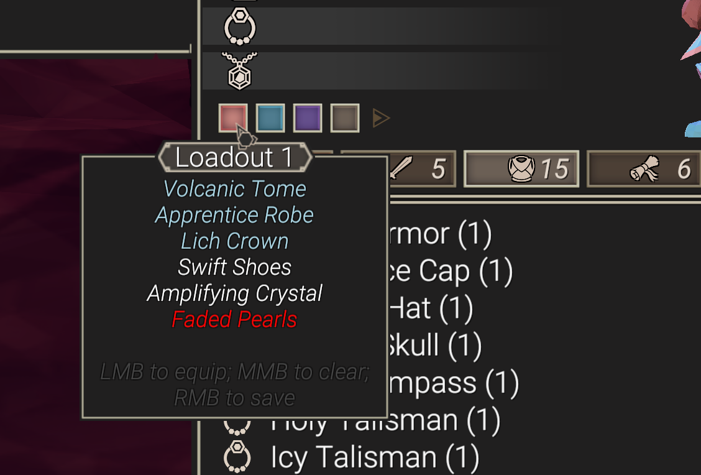
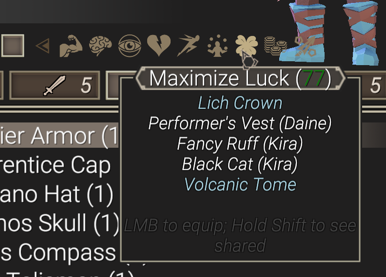
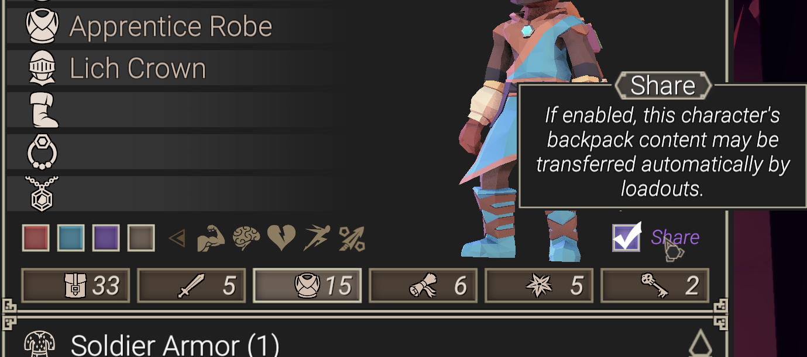
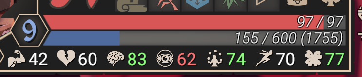
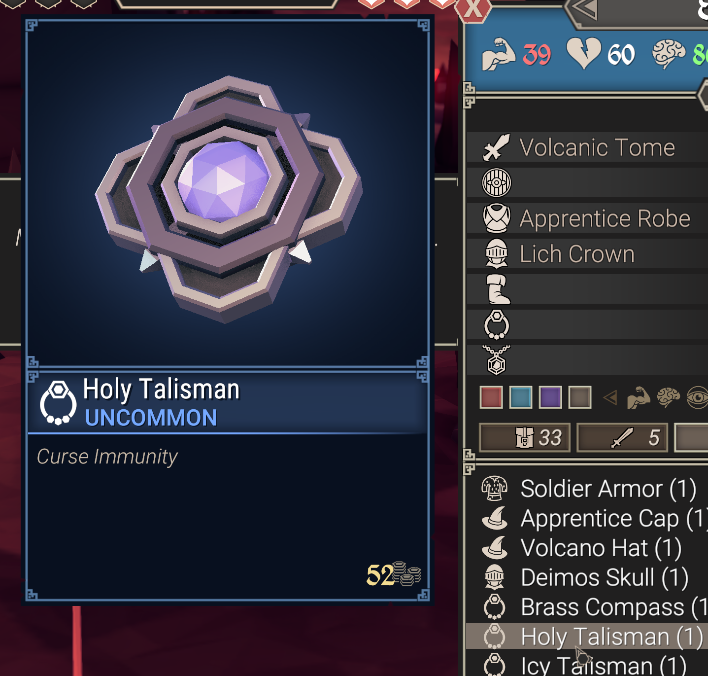
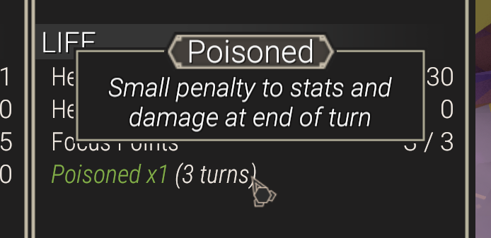
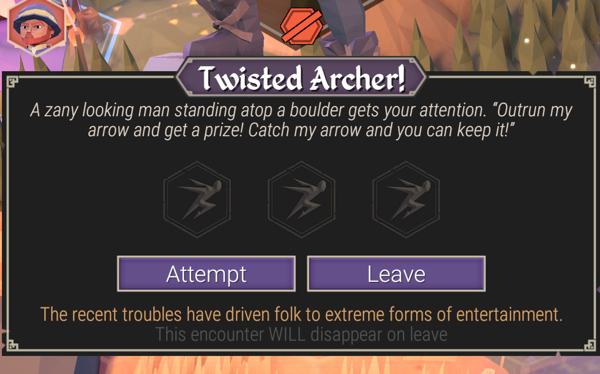
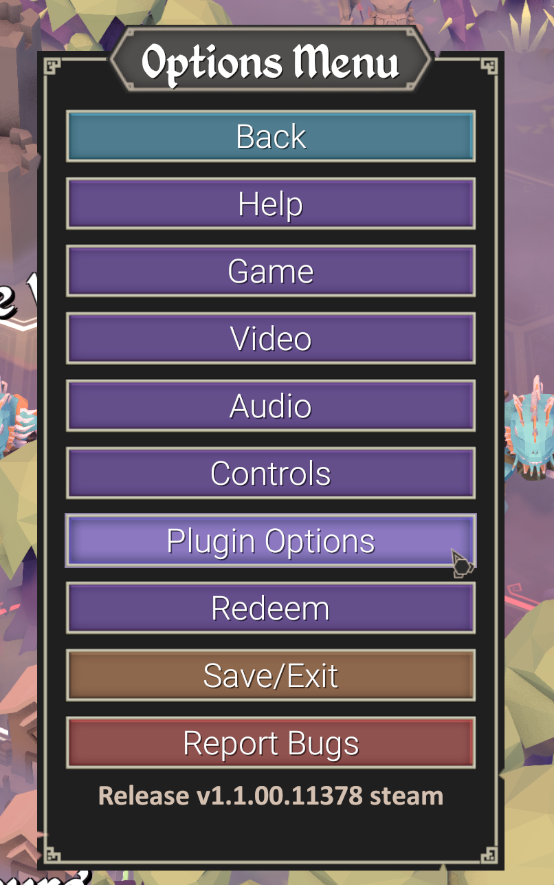
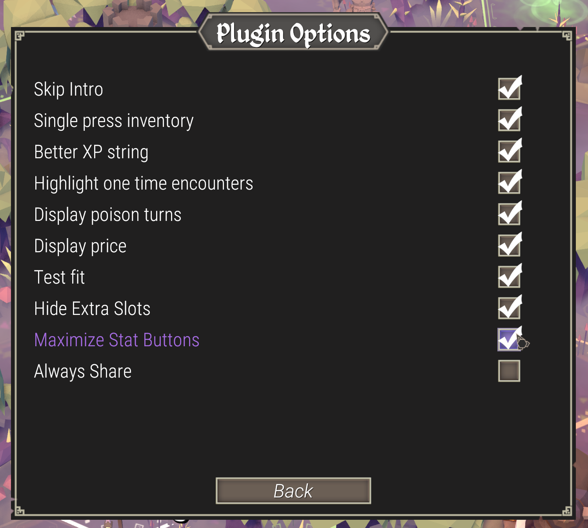

# Amadare's Quality of Life plugin

This plugin provides a lot of configurable tweaks and features that doesn't affect game balance but make your life easier.

## Features

- Equipment loadouts
- Extended stats display
    - Poison entry will display how much rounds it will still be active
    - XP bar now shows experience relative to current level
    - Added note to description and exclamation mark to title if encounter will disappear on leave
- Display item price in tooltip
- Skip intro
- Open inventory on first "I" press instead of focusing quick panel
- UI configuration

Detailed features overview can be found below.

## Installation

### Thunderstore (soon)

1. Install [Thunderstore Mod Manager](https://www.overwolf.com/app/Thunderstore-Thunderstore_Mod_Manager)
2. Install `AmadareQoL` mod
3. Start game by using Start Modded button

### Manual

1. Install latest [Bepinex](https://github.com/BepInEx/BepInEx/releases) 5.* version. You can refer to installation instructions [here](https://docs.bepinex.dev/articles/user_guide/installation/index.html)
2. Either install HookGenPatcher or add `MMHOOK_Assembly-CSharp.dll` to `BepInEx\plugins` folder from [this repo](https://github.com/ftk-modding/stripped-binaries)
3. Start game normally

## Equipement loadouts

Adds 5 slots to inventory to where you can save your loadouts to quickly switch between them.

**Buttons explanation**
- Red button means that some items from this loadout are missing in character inventory
- Blue button means that all items from this loadout are currently equipped
- Purple button mean that this loadout is set and can be equipped
- Brown buttons means empty slot to which you can save your loadout

**Controls**
- Left Mouse Button to equip loadout or save it to empty slot
- Right Mouse button to override existing loadout
- Middle Mouse Button to clear

In tooltip you can see equipment that is currently equipped (cyan), available (white) and missing in inventory (red).
If "Test Fit" is enabled, you'll see your character will-be stats when hovering on loadout button.

## Maximise stats buttons

If "Maximize Stat Buttons" option is enabled, you can extend buttons array by clicking arrow button. There will be displayed stat icons for all stats that can be maximized using available equipment. If there is no button for specific stat, then you cannot improve it using available equipment. 
Green number will display stat will-be stat value.

If "Test Fit" is enabled, you'll see your character will-be stats when hovering on loadout button.

### "Share" options

When holding SHIFT, you will be able to use equipment not only from current character inventory but from all neighboring players. Note that character should have "Share" checkbox enabled to agree with giving you items.
If you enable "Always Share" option, no checkbox will be displayed and every character will be able to share his items.

## Extended stats display

### Better XP string

If "Better XP string" option is enabled, game will display XP bar in more detailed format. In example above you can see that it is "155/600 (1755)". Where 155 is experience in current level, 600 is experience needed for next level and 1755 is total XP character have.

### Base Item Price

If "Display price" option is enabled, for each sellable item tooltip, base price will be displayed. Please note that you'll never be able to sell item by this price in shops. But if character is located in place where selling is possible, this value will be precisely display for how much you can actually sell it.

### Display poison turns

If "Display poison turns" option is enabled, you can check how many turns left until it wears off.

### Highlight one time encounters

Sometimes it is unclear if encounter will remain on map after you visit it. So, if "Highlight one time encounters" option is enabled exclamation mark will be added to encounter name as well as small footnote on encounter screen. 

_(on screenshot it is displayed incorrectly - I changed encounter definition for demo sake)_

### Other options

* **Skip Intro** - self explanatory: skips intro and warning about the fact that the game is hard
* **Single press inventory** - opens inventory by single "I" press: by default, when you press "I", instead of opening inventory, game will focus belt items and only opens it after second press
* **Generate steam_appid** - adds steam_appid.txt file for steam installation. It will resolve intermittent steam initialisation issues that causes game to be restarted after launch. Weird, I know. 

### Configuration

You can configure mod either by using Thunderstore configuration (if installed through Thunderstore) or after first run by editing `BepInEx/config/AmadareQoL.cfg` file.
You can also access some settings using in-game menu:

## Build

1. You'll need to provide stripped and publicized binaries. Those are included as git submodule. In order to get those you can:
   - When cloning this repository use `git clone --recurse-submodules`
   - OR If repository is already checked out, use `git submodule update --init --recursive`
   - OR Download or build them yourself using instructions from [this repo](https://github.com/ftk-modding/stripped-binaries)
2. (optional) Set `BuiltPluginDestPath` property in project file so after build binaries will be copied to specified location.
3. You should be able to build solution now

## License

MIT